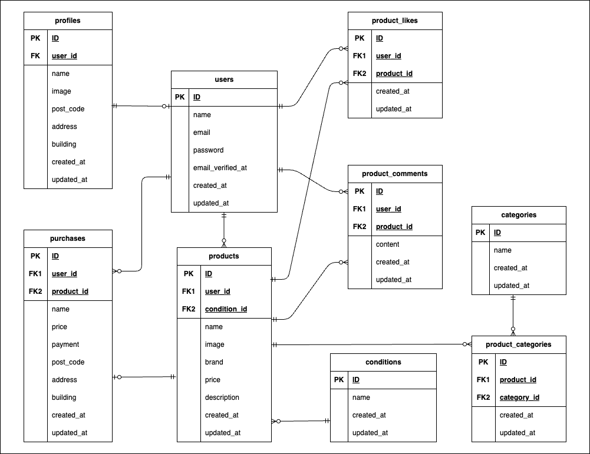

# Frea-Market -フリマアプリ-

## 概要

- fortifyを使用した登録、認証
- 商品の出品・購入
- プロフィールの登録・変更
- 商品の検索機能
- mailhogを使用したメール認証

## 使用技術

- Laravel Framework 8.83.29
- php:8.1-fpm
- nginx:1.21.1
- mysql:8.0.32
- phpMyAdmin

## 環境構築

### 1. Docker起動

```bash
git clone git@github.com:Yu-Sasaki451/Frea-Market.git
cd Frea-Market
docker compose up -d --build
```

### 2. Laravel環境構築

```bash
docker compose exec php bash
composer install
cp .env.example .env
```

`.env`に以下の環境変数を追加

```env

DB_CONNECTION=mysql
DB_HOST=mysql
DB_PORT=3306
DB_DATABASE=laravel_db
DB_USERNAME=laravel_user
DB_PASSWORD=laravel


MAIL_FROM_ADDRESS=no-reply@example.com
```

続けて、以下を実行してください。

```bash
php artisan key:generate
php artisan migrate --seed
php artisan storage:link
```

## テスト

### 1. Featureテスト（php artisan test）

```bash
docker compose exec mysql mysql -uroot -proot -e "CREATE DATABASE IF NOT EXISTS laravel_db_test;"
docker compose exec mysql mysql -uroot -proot -e "GRANT ALL PRIVILEGES ON laravel_db_test.* TO 'laravel_user'@'%'; FLUSH PRIVILEGES;"
```

その後、PHPコンテナ内で以下を実行してください。

```bash
php artisan test
```

### 2. Duskテスト（ブラウザテスト）

PHPコンテナ内で以下を実行してください。

```bash
php artisan dusk
```

## メール認証の確認手順

この確認手順はローカル環境（`localhost`）での実行を前提にしています。  

1. `http://localhost/register` からユーザー登録する  
2. ログイン後、認証案内画面（`/email/verify`）に遷移する  
3. `認証はこちらから` を押して Mailhog を開く  
4. Mailhog（`http://localhost:8025`）で認証メールを確認する  
5. メール内の認証リンクを押して認証完了を確認する

## 動作確認用アカウント（Seeder）

`php artisan migrate --seed` 実行後、以下でログインできます。

- email: `sandaikitetsu@test.com`
- password: `onepiece`

## URL

- 開発環境: http://localhost
- phpMyAdmin: http://localhost:8080
- Mailhog: http://localhost:8025

## ER 図


